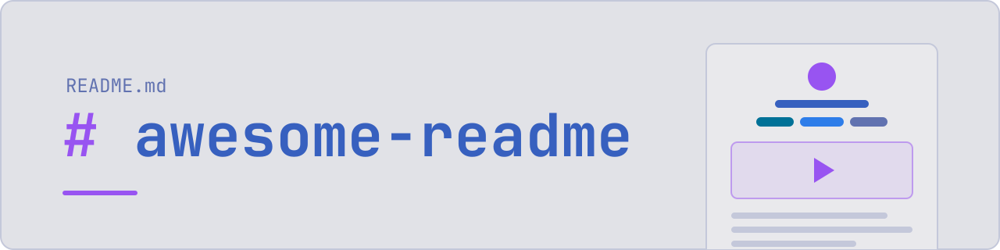

<div align="center">

<picture>
  <source media="(prefers-color-scheme: dark)" srcset="assets/banner-dark.svg">
  
</picture>

### Opinionated guide to READMEs for AI-driven development

**[<kbd> <br> Criteria <br> </kbd>][Criteria]**
**[<kbd> <br> Best practices <br> </kbd>][Best practices]**
**[<kbd> <br> Examples <br> </kbd>][Examples]**
**[<kbd> <br> Skill <br> </kbd>][Skill]**
**[<kbd> <br> Contribute <br> </kbd>][Contribute]**

---

</div>

While building projects with coding agents, I kept rewriting their READMEs. Over time, I have recognized some patterns and formed opinions on what makes a good README.

This repo is for people looking for inspiration, and for agents that need to be told what good looks like.

## What a README is for

A README is for someone who just landed on the repo. They want to know what the project does, what using it looks like, and how to install it. That's it.

It should show:

- what it looks like
- the main features
- a quickstart guide
- a basic overview of how it works
- how it compares to similar projects

It should not repeat what other files already say.

| Content | Where it goes |
| --- | --- |
| Full documentation, feature specs | `docs/` |
| Dev setup, contribution rules | `CONTRIBUTING.md` |
| License terms | `LICENSE` |
| Release history | `CHANGELOG.md` or GitHub releases |
| Guidance for AI agents | `AGENTS.md` |

## Best practices

### Header

- Logo or banner on top, project name in it.
- Centered header block with [shields.io](https://shields.io) badges, styled to match the project.
- A short description. Target 1 line.
- Section links under the header, styled with a bit of HTML.

### Show, then tell

- Put the visuals before the first paragraph. A gif or video beats a static screenshot.
- Spread visuals through the README, next to the feature they show.
- Pick a diagram that explains the project at a glance.
- Show logos for supported integrations instead of a bullet list of names.
- A gallery for projects where the output is the selling point.

### Light and dark

- Every image has to read on both GitHub themes. A black logo on a transparent background disappears in dark mode.
- Ship a light and a dark version of logos, banners and diagrams, and switch with `<picture>`:

```html
<picture>
  <source media="(prefers-color-scheme: dark)" srcset="assets/banner-dark.svg">
  
</picture>
```

- The `` is the fallback for npm, crates.io and other sites that ignore `<source>`, so point it at the version that works on white.
- Skip the `#gh-dark-mode-only` URL fragments. Outside GitHub, both images show.
- Mermaid diagrams follow the theme on their own. Don't hardcode colors in them.
- For an image with only 1 version, like a screenshot, give it a solid background.

### Text

- 1 idea per line. No walls of text.
- Short section titles. 1 word or a question ("Why?", "Install").
- Tables for comparisons, compatibility and supported targets. Keep columns to what matters.
- Put a chart next to benchmark tables, and a mermaid diagram next to architecture explanations.
- A "Lineage" section for a project evolving from prior projects.

### Install and quickstart

- 1 code block per command, so GitHub's copy button grabs exactly that command. No comments inside the block.
- Install in 1 command when possible.
- List install options as 1-line bullets that link to the details, or put them in collapsible `<details>` sections.
- A step-by-step quickstart or short tutorial to show it's easy to use.
- Explain why the project exists before the install section.

### Depth

- Show the main commands, not all of them. Link to the full reference.
- End with links to further docs for people who want more.
- A roadmap, if any, as a visual with clear phases.

## Examples

13 READMEs worth stealing from, grouped by kind of project.

### Developer CLIs

| Project | Takeaways |
| :---: | :--- |
| <a href="https://github.com/jdx/mise#readme"><br>mise</a> | <ul><li>Centered header</li><li>Custom styled shields</li><li>Usage videos</li></ul> |
| <a href="https://github.com/evilmartians/lefthook#readme"><br>lefthook</a> | <ul><li>Short, to-the-point text that's easy to scan</li><li>Clear structure with why, usage with a TL;DR, and install with copyable commands</li></ul> |
| <a href="https://github.com/charmbracelet/gum#readme"><br>gum</a> | <ul><li>Logo and demo before any paragraph</li><li>Opens with a tutorial</li><li>Gifs spread across the README</li></ul> |
| <a href="https://github.com/ajeetdsouza/zoxide#readme"><br>zoxide</a> | <ul><li>Collapsible sections per install method</li><li>Stylized demo gif</li></ul> |
| <a href="https://github.com/trufflesecurity/trufflehog#readme"><br>trufflehog</a> | <ul><li>Icon and a 3-word description</li><li>Logos for what it scans</li><li>Stylized demo gif, 1-command install</li><li>Step-by-step quickstart</li></ul> |
| <a href="https://github.com/spicetify/cli#readme"><br>spicetify</a> | <ul><li>Logo banner and shields</li><li>1-line description focused on the core</li><li>Features shown with images, original and modified side by side</li><li>Links out to install and user guides</li></ul> |

### Terminal and desktop

| Project | Takeaways |
| :---: | :--- |
| <a href="https://github.com/zellij-org/zellij#readme"><br>zellij</a> | <ul><li>Logo, then a gif of it in use right away</li><li>Roadmap as a chart with 3 clear phases</li><li>1-word or question section titles</li></ul> |
| <a href="https://github.com/hyprwm/hyprland#readme"><br>Hyprland</a> | <ul><li>Section links on top styled with HTML</li><li>Short feature list</li><li>Gallery of what people built with it</li></ul> |

### Languages and tools for writing

| Project | Takeaways |
| :---: | :--- |
| <a href="https://github.com/typst/typst#readme"><br>typst</a> | <ul><li>Banner with the project name</li><li>Centered shields</li><li>Explanation and main features right after, as bullets</li><li>Side-by-side Typst source and rendered output</li></ul> |

### AI and agent tools

| Project | Takeaways |
| :---: | :--- |
| <a href="https://github.com/OpenHands/OpenHands#readme"><br>OpenHands</a> | <ul><li>Logo and shields on top</li><li>Quickstart guide</li><li>Architecture section with diagrams</li><li>Links to further docs at the end</li></ul> |
| <a href="https://github.com/nexu-io/open-design#readme"><br>open-design</a> | <ul><li>Strong banner, centered sections below</li><li>Lots of images showing how to use it</li><li>Tight tables for competitor comparison and supported agents</li><li>"Lineage" section at the bottom instead of calling it a fork</li></ul> |

### Generators and assets

| Project | Takeaways |
| :---: | :--- |
| <a href="https://github.com/lowlighter/metrics#readme"><br>metrics</a> | <ul><li>Very visual, lots of output images</li><li>Setup options listed with links to detailed steps in another file</li></ul> |
| <a href="https://github.com/ryanoasis/nerd-fonts#readme"><br>nerd-fonts</a> | <ul><li>1 diagram that shows where each glyph set comes from</li><li>Download options as 1-sentence bullets with links</li><li>Font list as a table</li><li>font-patcher gets its own logo, marking it as a separate project inside the repo</li></ul> |

## Skill

[`skills/awesome-readme`](skills/awesome-readme/SKILL.md) turns all of the above into instructions for coding agents. Without them, agents tend to:

- write walls of text
- write slop, meaning puffery, em dashes, decorative emojis and title case headings
- add sections that belong in other files, like license, contributing, changelog and dev setup
- list install commands for every package manager instead of the one the project uses
- put comments inside install code blocks
- describe how the project is built instead of what it lets you do

Install it with [skills](https://github.com/vercel-labs/skills).

```sh
npx skills add shbernal/awesome-readme
```

For prose, pair it with the [unslop skill](https://github.com/cursor/plugins/blob/main/pstack/skills/unslop/SKILL.md).

<!----------------------------------------------------------------------------->

[Criteria]: #what-a-readme-is-for
[Best practices]: #best-practices
[Examples]: #examples
[Skill]: #skill
[Contribute]: CONTRIBUTING.md
